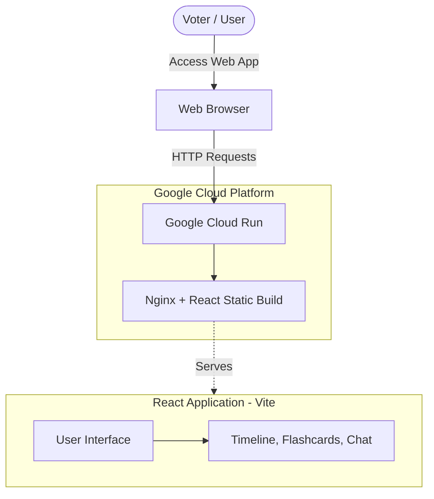
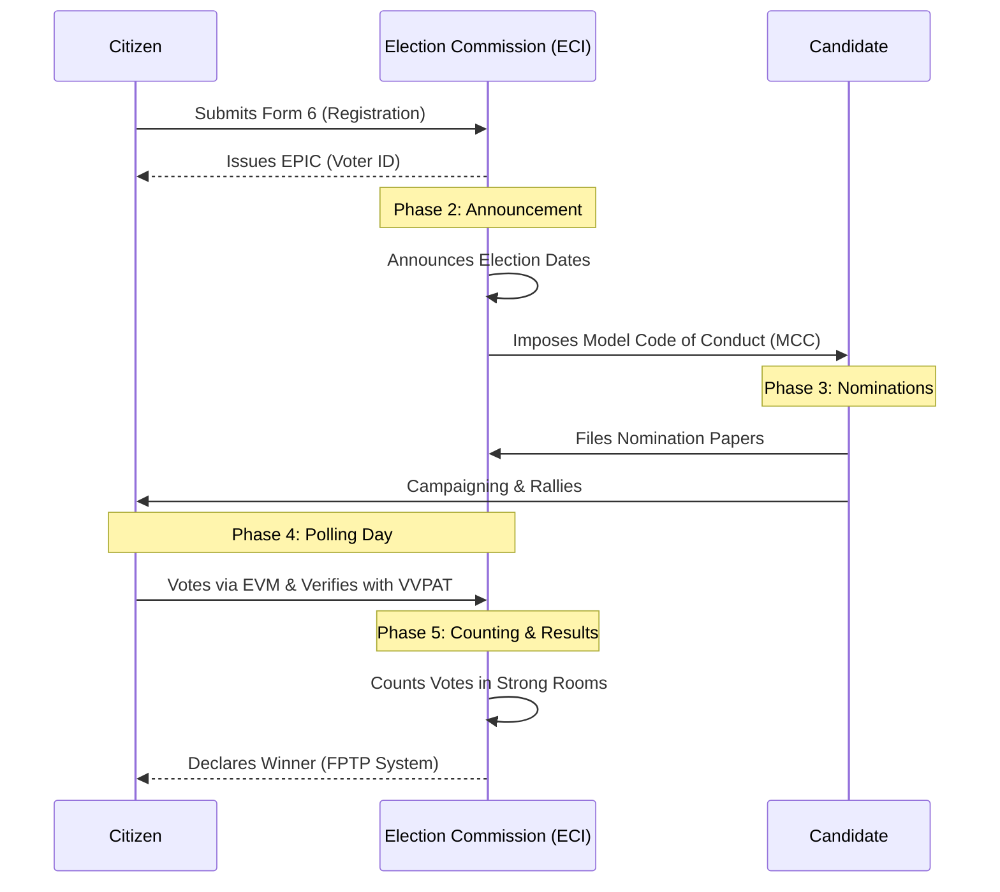

# 🇮🇳 Indian Election Assistant

**🌍 Live Demo:** [https://election-assistant-31432095152.asia-south1.run.app](https://election-assistant-31432095152.asia-south1.run.app)

An interactive and engaging web application built to help citizens understand the world's largest democratic process. This assistant guides users through the various phases of the Indian Election System, teaches key electoral terminology using interactive flashcards, and provides an AI-powered chat interface to answer common questions.

## 🌟 Features

- **Interactive Timeline:** A step-by-step visual guide covering everything from Voter Registration to Counting & Results.
- **Terminology Flashcards:** 3D-flippable cards to quickly learn essential acronyms like EVM, VVPAT, NOTA, and MCC.
- **Informational FAQ:** Comprehensive answers on eligibility, finding polling booths, and voter registration (Form 6).
- **AI Chat Assistant:** A simulated conversational interface where users can ask questions and get instant, rule-based answers regarding the election process.
- **Premium UI/UX:** Built with a modern dark-mode aesthetic featuring glassmorphism, responsive design, and smooth CSS animations.

---

## 🏗️ Architecture

The application is built using a modern frontend stack and containerized for scalable deployment on Google Cloud Platform.



---

## 📊 Election Process Flow

Here is a high-level overview of the Indian Election phases represented in the application:



---

## 🚀 Local Development

To run this project locally on your machine:

1. **Install Dependencies:**
   ```bash
   npm install
   ```

2. **Start the Development Server:**
   ```bash
   npm run dev
   ```

3. Open your browser and navigate to `http://localhost:5173`.

---

## ☁️ GCP Deployment (Cloud Run)

This project is configured to be deployed easily to Google Cloud Run using Docker.

1. Build the Docker container locally (optional):
   ```bash
   docker build -t election-assistant .
   ```

2. Deploy directly to Google Cloud Run using the `gcloud` CLI:
   ```bash
   gcloud run deploy election-assistant --source . --port 8080 --allow-unauthenticated
   ```

## 🛠️ Tech Stack
- **Frontend:** React, Vite, Lucide Icons
- **Styling:** Vanilla CSS (Glassmorphism, Animations)
- **Deployment:** Docker, Nginx, Google Cloud Run
